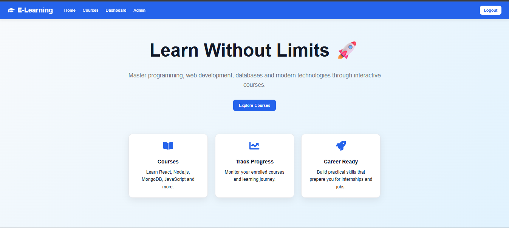
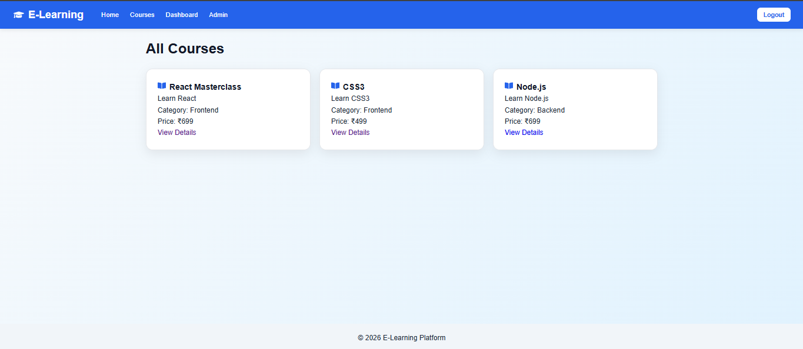
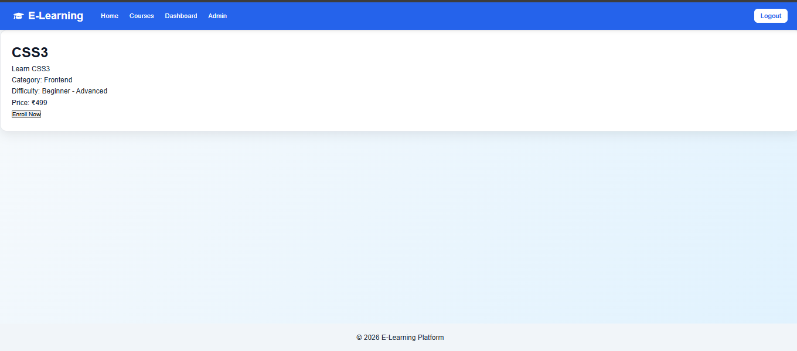
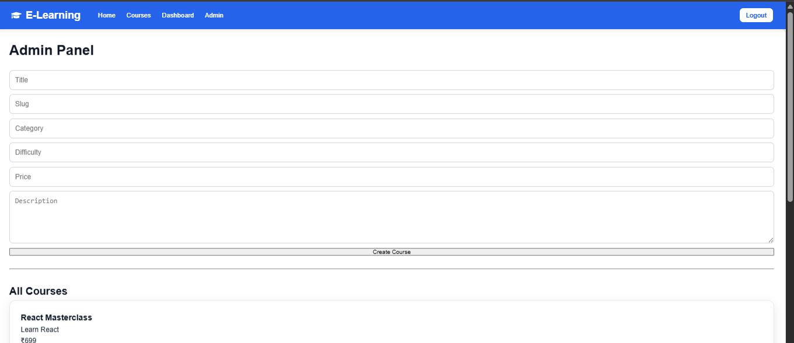

# E-Learning Platform

An E-Learning Platform built using the MERN Stack that allows users to browse courses, enroll in courses, track their learning progress, and provides an admin panel for managing courses.

## Features

### User Features

* User Registration and Login
* JWT Authentication
* Browse Available Courses
* View Course Details
* Enroll in Courses
* Track Learning Progress
* User Dashboard

### Admin Features

* Create New Courses
* Update Existing Courses
* Delete Courses
* Manage Course Content

### Additional Features

* Protected Routes
* Toast Notifications
* Responsive User Interface
* MongoDB Database Integration

---

## Tech Stack

### Frontend

* React.js
* React Router DOM
* Axios
* React Toastify
* React Icons

### Backend

* Node.js
* Express.js

### Database

* MongoDB Atlas
* Mongoose

### Authentication

* JSON Web Token (JWT)
* bcryptjs

---

## Project Structure

```text
E-Learning-Platform
│
├── backend
│   ├── config
│   ├── controllers
│   ├── middleware
│   ├── models
│   ├── routes
│   └── server.js
│
├── frontend
│   ├── public
│   ├── src
│   │   ├── components
│   │   ├── context
│   │   ├── pages
│   │   ├── services
│   │   └── App.jsx
│   └── package.json
│
└── README.md
```

---

## Installation

### Clone Repository

```bash
git clone https://github.com/YOUR_USERNAME/E-Learning-Platform.git
cd E-Learning-Platform
```

### Backend Setup

```bash
cd backend
npm install
```

Create a `.env` file inside the backend folder:

```env
PORT=5000
MONGO_URI=your_mongodb_connection_string
JWT_SECRET=your_secret_key
```

Start Backend Server:

```bash
npm run dev
```

### Frontend Setup

```bash
cd frontend
npm install
npm run dev
```

---

## API Endpoints

### Authentication

| Method | Endpoint         | Description   |
| ------ | ---------------- | ------------- |
| POST   | /api/auth/signup | Register User |
| POST   | /api/auth/login  | Login User    |

### Courses

| Method | Endpoint         | Description           |
| ------ | ---------------- | --------------------- |
| GET    | /api/courses     | Get All Courses       |
| GET    | /api/courses/:id | Get Course Details    |
| POST   | /api/courses     | Create Course (Admin) |
| PUT    | /api/courses/:id | Update Course (Admin) |
| DELETE | /api/courses/:id | Delete Course (Admin) |

### Enrollment

| Method | Endpoint                    | Description          |
| ------ | --------------------------- | -------------------- |
| POST   | /api/enrollments/:courseId  | Enroll in Course     |
| GET    | /api/enrollments/my-courses | Get User Enrollments |

---

## Screenshots

### Home Page


### Login Page


### Courses Page


### Course Detail Page


### Dashboard
.png)

### Admin Panel


---

## Future Improvements

* Course Search and Filters
* Video Lessons
* Quiz System
* Certificate Generation
* Payment Integration
* Role-Based Dashboard

---

## Author

Developed by Juhi Dubey
